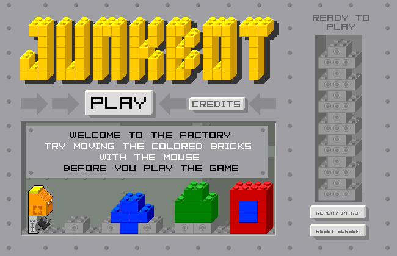

# [Janitorial Android][play Junkbot]

An HTML5 remake of LEGO [Junkbot][] and [Junkbot Undercover][] games, nearly complete!

[][play Junkbot]

- [**Play LEGO Junkbot**][play Junkbot]

- [**Play LEGO Junkbot Undercover**][play Junkbot Undercover]

- [**Run automated tests**][tests]

- [**Create your own levels**][level editor]

All mechanics from the original games are implemented:
- Dragging bricks, and handling grabs that are ambiguous until you drag up or down, with cursors for different dragging options (up, down, or either)
- Loading the original level format
- Junkbot's movement and animations
- Recycling bins (the level goals)
- Fire bricks
- Fans
- Switches
- Jump blocks
- Dripping pipes
- Shield powerups
- Gearbots, climbbots, flybots, and eyebots (aside from exact timings and some edge cases)
- Crates (upside-down white bricks that you can push)
- Laser beams

## [Level Editor][level editor]

I've made a level editor with all functions you might expect (Rectangular selection, select all, copy, cut, paste, delete, undo, redo, autosave, save to file, open from file, insert entities via a palette).

I filled gaps in the sound design by taking sound effects from [Lego Creator][], which holds additional nostalgia for me.

## 3D Renderer

I made a tool to render LDraw models into the [oblique projection][] that Junkbot uses, using [Three.js][]'s [LDrawLoader][]; you can check that out [here][3D renderer].

I've put together models including Basic Bricks for comparison to the original sprites, and Junkbot and some other bots, and miscellaneous objects that might be interesting to add to the game. This will probably be useful as a pipeline for jump-starting artwork to bring new pieces into the game, but if I got it good enough, it could open the possibility of running the game in 3D... it could have like a Fez moment... but 3D probably wouldn't fit in to the gameplay mechanics nicely.

I want to make it match Junkbot's art style better, in particular with the studs. For the studs:
1. I could do an image-based find and replace (but this will have to account for different brick colors, and... hopefully not occlusions).
2. Or I could replace the stud sub-part in the model with something that renders a single pixel in a particular color to search for (this would also have problems with occlusion).
2. Or I could replace the stud sub-part with a customized 3D stud model designed to render nicely in pixel art with a toon shader.

I also looked into Blender. Blender doesn't support oblique projection, but there's a nice [ImportLDraw plugin](https://github.com/TobyLobster/ImportLDraw) for it, and there's a [workaround for the projection](https://blenderartists.org/t/oblique-camera-projection-possible/673635/4) using a Lattice modifier.
Blender isn't especially geared towards pixel art, but Sam Drost's oblique projection emulation is *also* for the purpose of creating new pixel art for an old game, so the template might help for more than just the projection.
That said, Blender is pretty hard to learn, and the Lattice modifier has some problems, creating serious lighting artifacts since it's changing the geometry not the camera.

## Controls

Drag bricks with the mouse. You don't control Junkbot directly. Junkbot moves on his own.

Use the arrow keys or <kbd>WASD</kbd> (or similar patterns of keys on layouts other than QWERTY) to pan the view.

<table>
	<tr>
		<td><kbd>E</kbd></td>
		<td>Toggle edit mode</td>
	</tr>
	<!-- <tr>
		<td><kbd>P</kbd> or <kbd>Spacebar</kbd></td>
		<td>Pause / unpause</td>
	</tr> -->
	<tr>
		<td><kbd>M</kbd></td>
		<td>Mute / unmute</td>
	</tr>
	<tr>
		<td><kbd>+</kbd></td>
		<td>Zoom in</td>
	</tr>
	<tr>
		<td><kbd>-</kbd></td>
		<td>Zoom out</td>
	</tr>
	<tr>
		<td><kbd>`</kbd></td>
		<td>Toggle debug information (including collision and NaN detection)</td>
	</tr>
</table>

When in editor mode:

Click on the background and drag to select objects within a rectangle.

Hold <kbd>Ctrl</kbd> and click to drag an individual object.

<table>
	<tr>
		<td><kbd>Ctrl</kbd>+<kbd>C</kbd></td>
		<td>Copy selected to clipboard</td>
	</tr>
	<tr>
		<td><kbd>Ctrl</kbd>+<kbd>X</kbd></td>
		<td>Cut selected to clipboard</td>
	</tr>
	<tr>
		<td><kbd>Ctrl</kbd>+<kbd>V</kbd></td>
		<td>Paste from clipboard</td>
	</tr>
	<tr>
		<td><kbd>Delete</kbd></td>
		<td>Delete selected</td>
	</tr>
	<tr>
		<td><kbd>F</kbd></td>
		<td>Flip selected horizontally</td>
	</tr>
	<tr>
		<td><kbd>T</kbd></td>
		<td>Toggle selected switches/things</td>
	</tr>
	<tr>
		<td><kbd>Ctrl</kbd>+<kbd>Z</kbd></td>
		<td>Undo</td>
	</tr>
	<tr>
		<td><kbd>Ctrl</kbd>+<kbd>Shift</kbd>+<kbd>Z</kbd> or <kbd>Ctrl</kbd>+<kbd>Y</kbd></td>
		<td>Redo</td>
	</tr>
	<tr>
		<td><kbd>Ctrl</kbd>+<kbd>A</kbd></td>
		<td>Select all</td>
	</tr>
	<tr>
		<td><kbd>Ctrl</kbd>+<kbd>S</kbd></td>
		<td>Save world to a file</td>
	</tr>
	<tr>
		<td><kbd>Ctrl</kbd>+<kbd>O</kbd></td>
		<td>Open a saved world file</td>
	</tr>
</table>

## Credits

### Web Remake

Isaiah Odhner

### Ripping resources
- [Rory Fewell](https://github.com/rozniak) and [TommytheJerk](https://github.com/TommytheJerk), via project [rozniak/Junkbot](https://github.com/rozniak/Junkbot)
- Tools: CastRipperTool (Nosamu), SharpExport (Werner), swfExport Xtra (Valentin Schmidt), MP3 Xtra (Valentin Schmidt)

### Some sounds taken from
- Lego Creator (editor sounds)
- Lego Star Wars: Force Awakens (lego rustling sounds)
- (in addition to Junkbot)

### Credits for Junkbot & Junkbot Undercover

##### Art
Peter Lee / Frank Lantz

##### Code
Ranjit Bhatnagar / Peter Lee

##### Game Design
Frank Lantz / Eric Zimmerman / Nick Fortugno

##### Project Management
Peter Lee / Frank Lantz

##### Sound
Michael Sweet - Blister Media

##### Lego Producer
Tomas Clark

## Various Ideas

- Metroidvania
	- Instead of abilities like Jump (like in some Metroidvanias), you collect blocks like Jump Block, that you can then place in any level (or most levels, maybe not some levels, arbitrarily, where it would break a puzzle in an unfun way)
- Gear systems
	- Sort of like this [Lego Technic Challenge game](http://biomediaproject.com/bmp/files/LEGO/gms/online/Technic/LegoMechanic/) ([video here](https://www.youtube.com/watch?v=vjevgPI6FWs))
- Machine that clones Junkbot
	- You can win as long as one Junkbot remains
- Ridable giant robots / cars? maybe that you can build!
- Liquid simulation?
	- Flowing water that kills you
	- Flowing oil that doesn't, because it's not conductive
	- Grate / Drain (liquid can pass through, but is otherwise solid)
	- "Dam" / "water lock" / "hydrophobic" / "no water" block (no water can pass, but you can)
- Tetris area where you need to fix machinery that pushes the bottom four rows into trucks
- Pac-Man area with wrapping
- Dunkbot (basketball)
- Music
	- Junkbach
	- Crunkbot
	- Funkbot
	- Punkbot
- Slanted bricks that reflect lasers
- Force field / hard light transparent bricks that can be powered on to make it solid, and can be built with!
	- Implies you can create areas where you can't build but can still move through, particularly if it's locked into unmovable ground and ceiling
	- Variations:
		- Color per switch, toggles solidity from anywhere; solidity always matches switch
		- Solid while connected to some sort of pad, while pad is powered; can connect through other bricks
		- Toggles when connected to a pad, and a button is pressed; can connect through other bricks
- Speed powerup that makes junkbot go uncomfortably fast
	- Buildup animation with sound ju-ju-ju-ju...tdtdtdtdtkwhh~!
- Various electrical systems
	- Turbine generator that can power things when powered by wind
	- Circuits
	- although it might be weird to tack on circuits to junkbot when previously everything happens without visible wires
- Infinite brick source
	- Could come out of a hole in the ground, for a simple look
	- Could use LEGO piece 630 Conveyor Belt, for a fancy 3D aesthetic
- Moving platforms
	- LEGO vehicle base?
- An antagonist junkbot that dumps out trash cans on purpose >:D
	- Skunkbot/Gunkbot/Stunkbot/Slunkbot?
- Wall-crawler gearbot
	- Interlinking gearbots?? I think they could implicitly fly together like [troll physics](https://i.imgur.com/4NqKmL6.png), anything further than that is probably too complicated, especially with the grid
- Overworld
	- Thematic areas like:
		- Sewers with lots of water hazards
		- Vents with claustrophobic puzzles and fans
		- Shipping warehouse with large amounts of blocks, tetris level, crates
		- Hedge maze level with maze of green blocks, with an eyebot that chases you
		- Production line with... conveyor belts? that's the traditional mechanic
		- Chocolate chip cookie where the chips are teleporters...?
	- Multiple paths in some areas, which might be specifically chosen to circumvent certain harder levels
	- Places unlocked by keycards
	- Gold award doors based on getting par in a particular level; they visibly latch once you go over par
	- Interludes when entering an area for the first time
		- Quotes from Robert Frost to make it more dramatic
		- Kipling, who wrote like the national poem of England, if that's a thing, I don't know if it is but if so he wrote it
	- Vending machines where you can buy snacks, which Junkbot then opens, throws in the trash, and then eats, trash can and all
		- Also maybe a paint job, sunglasses (most expensive), etc.
		- When Junkbot purchases the final item, he crushes the vending machine and eats it
- For the level editor, maybe some more rustling sound effects from:
	- https://freesound.org/people/SomeoneCool15/sounds/423782/
	- https://freesound.org/people/sampson021/sounds/262584/

## Development Setup

Requirements:
- [Git][]
- [Node.js][]
- Lack of LEGO litigation

Steps
- [Clone the repo.][git clone]
- Open up a command prompt / terminal in the project directory.
- Install project dependencies with `npm install`
- Run `npm start` to start a web server which will reload the page automatically when you make changes.

[Node.js]: https://nodejs.org/
[Git]: https://git-scm.org/
[git clone]: https://help.github.com/articles/cloning-a-repository/
[play Junkbot]: https://1j01.github.io/janitorial-android/#junkbot
[play Junkbot Undercover]: https://1j01.github.io/janitorial-android/#junkbot2
[tests]: https://1j01.github.io/janitorial-android/#tests
[level editor]: https://1j01.github.io/janitorial-android/#level-editor
[3D renderer]: https://1j01.github.io/janitorial-android/three
[Junkbot]: https://brickipedia.fandom.com/wiki/Junkbot
[Junkbot Undercover]: https://brickipedia.fandom.com/wiki/Junkbot_Undercover
[Lego Creator]: https://brickipedia.fandom.com/wiki/5700_LEGO_Creator
[Three.js]: https://threejs.org/
[LDrawLoader]: https://threejs.org/examples/webgl_loader_ldraw.html
[oblique projection]: https://en.wikipedia.org/wiki/Oblique_projection
